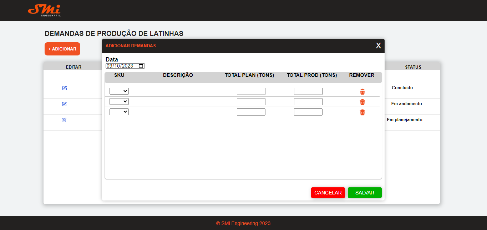

# Desafio SMI Engenharia

## Orientações de Instalação

Siga estas instruções para instalar e executar o projeto em sua máquina local:

1. Clone o repositório Git em sua máquina local.
2. Abra o terminal em seu VSCode.
3. Acesse a pasta backend, utilizando o comando `cd ./backend-smi/`.
4. No terminal, digite `npm install`.
5. Após a instalação das dependências, digite `node index.js`. O servidor será iniciado na porta localhost:3001.
6. Abra um novo terminal em seu VSCode, mantendo o primeiro terminal aberto (que está executando o servidor do projeto).
7. No novo terminal, navegue até a pasta frontend utilizando o comando `cd ./front-end-smi/`.
8. Digite `npm install` para instalar as dependências novamente.
9. Digite `npm run dev`. O sistema iniciará na porta 'localhost:3000'. Acesse a porta colando o endereço em seu navegador ou clique em cima da mensagem enquanto pressiona a tecla CTRL.
10. O projeto começará a rodar.

## Funcionalidades

O sistema é capaz de:

1. Exibir uma tabela vazia, na qual em cima há um botão Adicionar, para adicionar uma demanda de produção de latinhas.
2. Abrir uma janela modal, onde o usuário escolhe entre as opções de 'SKUs' (códigos de produtos) e depois preenche as informações desejadas.
3. Ao salvar as informações desejadas, a demanda é adicionada à tabela principal.
4. Mostrar os valores de Total Planejado (Toneladas) e Total Produzidos (Toneladas), que são correspondentes a soma dos produtos adicionadaos.
5. Lidar com a lógica de regra de negócio que diz:
   - Se o valor de Total Planejado for igual ao valor de Total Produzido, o campo Status é preenchido como "Concluído".
   - Se o valor de Total Planejado for menor que o valor de Total Produzido, o campo Status é preenchido como "Em andamento".
   - Se o valor de Total Produzido for igual à zero, o campo Status é preenchido como "Em planejamento".
7. Excluir demandas ao clicar no ícone de edição e em seguida 'Excluir Demanda'.

## Próximos passos

1. Excluir demandas individualmente.
2. Implementar uma melhor estilização da tabela principal.
3. Conseguir salvar as alterações no campo de edição de demandas.
4. Implementar responsividade.

## 🤝 Responsável pelo projeto

<table>
  <tr>
    <td align="center">
      <a href="#">
       
        
          <b> Pedro Henrique</b>
        
      </a>
    </td>
